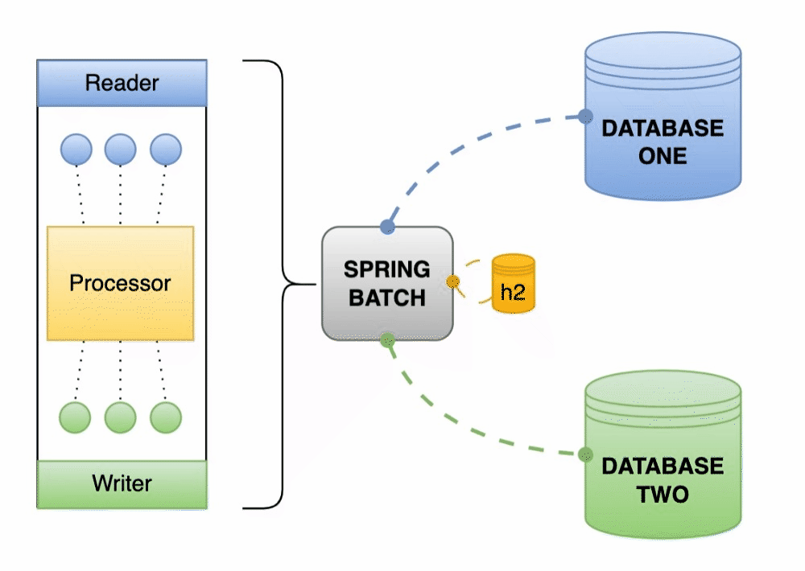

# Spring Batch

Procesamiento en lote de información de una base de datos a otra base de datos
Tablas de configuración embebidas en h2

## Stack

- SpringBoot 3.1.3
- JPA
- JDK17
- Maven
- Postgres | h2
- Docker | Docker Compose

## Run
```shell
docker-compose -f docker-compose.yaml -p spring-batch-db up -d --build
``` 
## Down
```shell
docker-compose -f docker-compose.yaml -p spring-batch-db down --rmi local --remove-orphans --volumes
```

## Arquitectura
